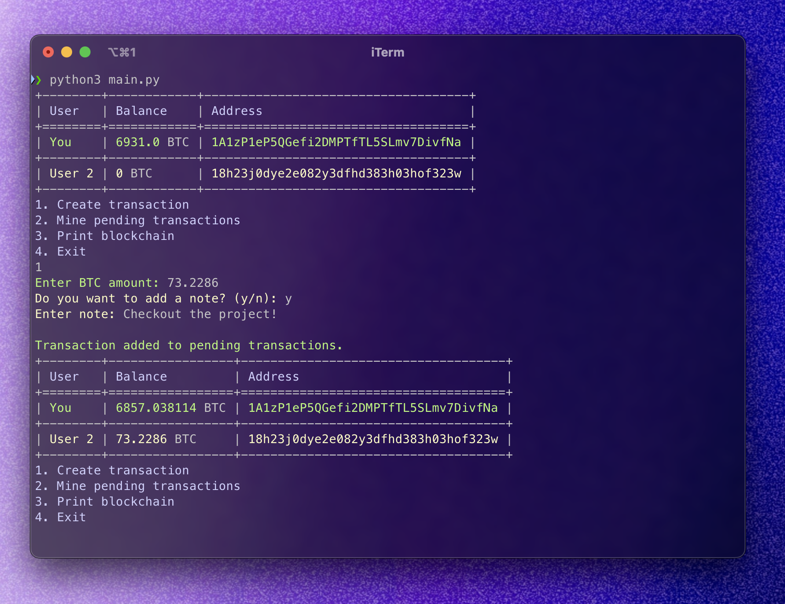

# Blockchain in Python

A simple blockchain implementation in Python with a command-line interface for managing transactions between two users.

## Features

- Create and process transactions between users
- Mine pending transactions into new blocks
- Automatic fee calculation based on transaction amount and network load
- Double-spending prevention
- Transaction notes support
- Colored terminal interface
- JSON blockchain data persistence

## Requirements

- Python 3.13+
- uv package manager
- devbox

## Installation

1. Clone the repository:
```bash
git clone https://github.com/yourusername/py-blockchain.git
cd py-blockchain
```

2. Install dependencies using uv:
```bash
uv pip install tabulate colorama
```

## Usage

1. Start the application:
```bash
source .venv/bin/activate
python main.py
```

2. Available commands:
   - Create transaction: Enter amount and optional note
   - Mine pending transactions: Process pending transactions into a new block
   - Print blockchain: View and save the current blockchain state
   - Exit: Close the application

## Project Structure

- `main.py`: Main application entry point and CLI interface
- `utils.py`: 
   - Core blockchain implementation (Block, Blockchain, Wallet) 
   - Utility functions for transaction handling and display
   - Raw data to work with
- `blockchain_data.json`: Appear after 'Print blockchain' (option 3 in CLI)

## How It Works

1. The blockchain starts with two users, each having an initial balance
2. Transactions are created with:
   - Sender and receiver addresses
   - Amount
   - Fee (automatically calculated)
   - Optional note
   - Timestamp
3. Transactions are validated for:
   - Sufficient balance
   - No double-spending
4. Pending transactions are mined into new blocks when:
   - 10 transactions are pending
   - User manually triggers mining
5. Each block contains:
   - Index
   - Timestamp
   - Transactions
   - Previous block hash
   - Current block hash
   - Nonce (for mining)

## Fee Calculation

Transaction fees are calculated based on:
- Base fee: 0.0010 BTC
- Amount fee: 0.10% of transaction amount
- Network load factor: Increases with more pending transactions

